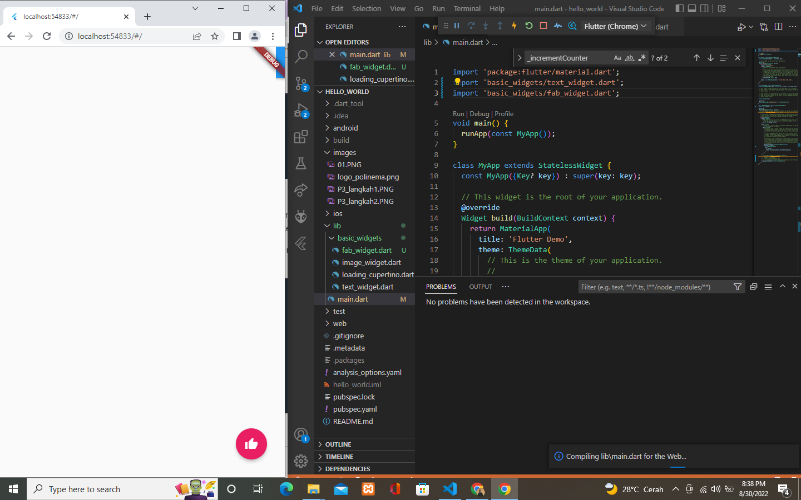
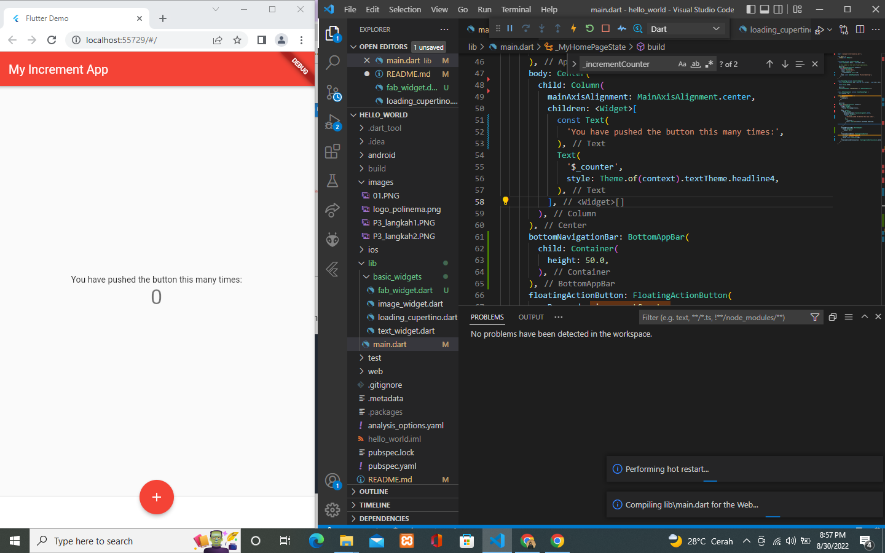

# hello_world

# Nama : Addina Nurul Mawaddah

## Praktikum 2
 

## Praktikum 3
### Langkah 1 : Text Widget
 
### Langkah 2 : Image Widget
 

## Praktikum 4
### Langkah 1 : Cupertino Button dan Loading Bar
 
### Langkah 2 :  Floating Action Button (FAB)
 
### Langkah 3 : Scaffold Widget
 
### Langkah 4 : Dialog Widget
 
### Langkah 5 : Input dan Selection Widget
 
### Langkah 6 : Date and Time Pickers
### 1. Tampilan Utama
 
### 2. Tampilan Date
.PNG) 
### 1. Tampilan Setelah diperbahuri
.PNG) 

